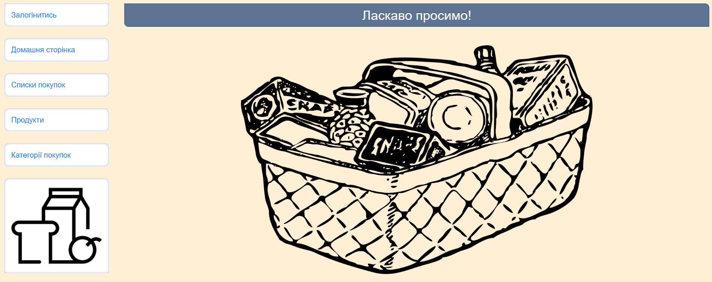
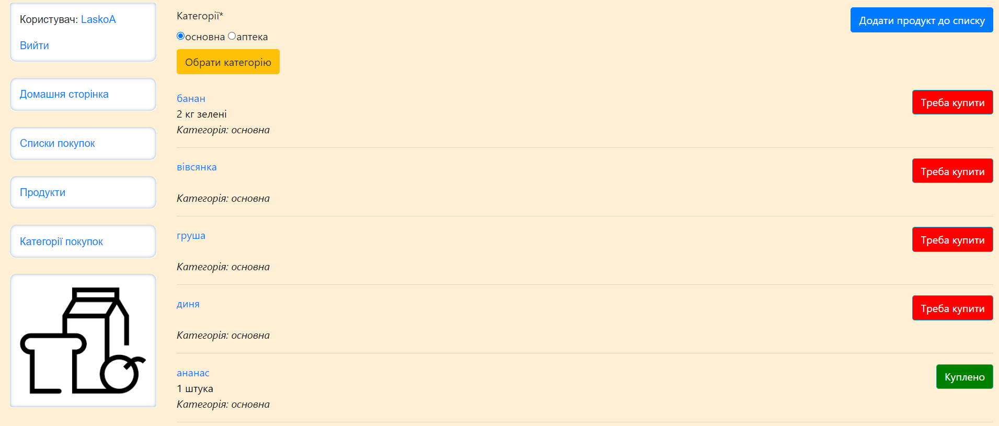
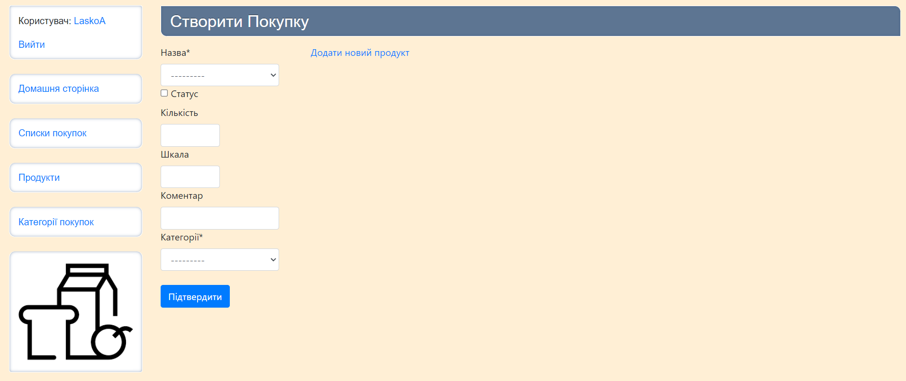

# Grocery List

Django project for family shopping

[GroceryList deployed to Pythonanywhere](http://laskoa.pythonanywhere.com/)

## Installation

Python3 must be installed

```shell
git clone https://github.com/LaskoA/GroceryList
cd GroceryList

Virtual environment install for Windows:
  - python3 -m venv venv
  - source venv/bin/activate
  - pip install -r requirements.txt
  
Virtual environment install for Mac:
  - sudo pip install virtualenv
  - virtualenv env
  - source env/bin/activate
  
python manage.py runserver
python manage.py makemigrations
python manage.py migrate
```

## Features

- access of all family members to online grocery list
- AJAX method was implemented to change purchase status without page reload and scrolling
- add or update app when it`s convenient to not forget something important
- create and modify purchases, products, categories
- user-friendly interface, purchases are sorted according to statuses and names 
- possibility to vied detailed information about each item


## Demo



